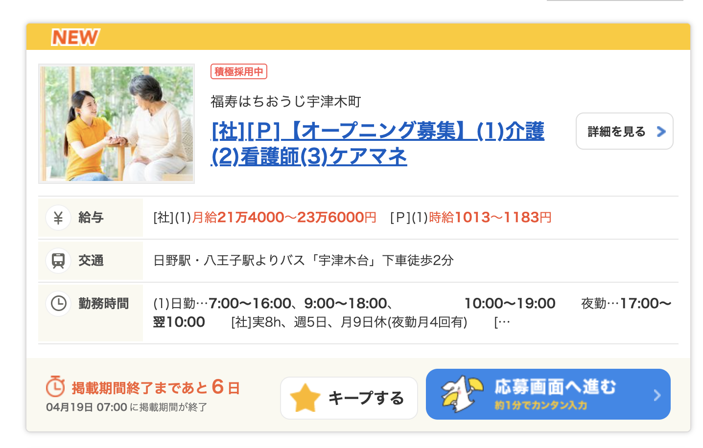

# 以下の流れで課題の準備
## 1. 環境構築
* Node.jsをインストールしていない場合  
こちらのサイトを参考にインストール >>[こちら](https://qiita.com/ttokdev/items/3547587b0494dd624901)<<  

* Nodeのバージョンは以下を設定
`Node.js: 14.16.0`
### onokeリポジトリを作成
```
git clone https://github.com/kdi0618/onoke.git
cd onoke
```
### npm系のコマンドを使えるようにする
```
nodenv install 14.16.0
nodenv local 14.16.0
node --version
```
↑最後のコマンドを打った際に`v14.16.0`と表示されたらOK

## 2. 作業ブランチを準備
```
git checkout -b develop/自分の名前
git checkout -b develop/自分の名前-townwork
```
### `JavaScript`の諸々のライブラリをインストール
```
npm install
```
### npmコマンドで開発サーバーを立ち上げて作業開始！
以下のコマンドを実行
```
npm start
```
実行後、ブラウザにURL`http://localhost:8080/index.html`の画面が表示されたらOK！

# 課題内容
## 以下の画像を模写してください  
  

[実際の動きはサイトを参考にしてね！](https://townwork.net/joSrchRsltList/?ac=041&slc=0113&suc=01&svos=SCP01030101Salary0113)

## 要件
* 画像通りの画面を、HTML, CSSで作れる
* JavaScriptを使って、画面下のキープ機能を作れる

### 
* 「給与」「交通」「勤務時間」の左のアイコンやその他のアイコンは作らなくていいです。  
  * 代わりに全部のアイコンに、`assets/train.png`を使ってください